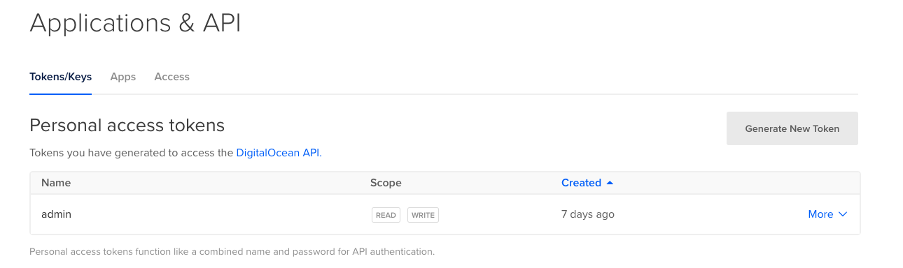

# Setup Digital Ocean

Digital Ocean is the platform selected to create the Kubernetes cluster. If this is the first time you have heard about this platform, do not worry, because all your services can be accessed easily and easily.

## Create new user on Digital Ocean

If you do not have a user on the Digital Ocean platform, you can [use this link to create an account with $ 100 of credit at startup](https://m.do.co/c/fb2c605da7ee). The cost of the exercise performed in this laboratory is $ 20 per month (**$ 0.030 per hour**).

## Create a personal token

The personal access token will be used to manage the components of the platform through the `doctl` client.

* Access the [API section](https://cloud.digitalocean.com/account/api/tokens) and generate a new token with read and write permissions.
* Copy and save the generated code securely for used in the next sections.

After creating the token you should obtain a result similar to the one shown in the following image.



## Intall doctl

`doctl` is the Digital Ocean client. Through this system you can access to all the resources of the platform from the Terminal.

Use the following link to install `doctl`: <https://github.com/digitalocean/doctl#installing-doctl>

The version to be installed must be equal to or greater than `1.41.0`.

```bash
doctl version

doctl version 1.41.0-release
```

## Setup doctl

Use the `auth init` command to authenticate the `doctl` client with the platform. Use the token generated in the previous section as the input parameter.

```bash
doctl auth init

DigitalOcean access token:
Validating token... OK
```

Check that there is good communication between the `doctl` client and the platform. List the Kubernetes available versions in the platform using the following command:

```bash
doctl kubernetes options versions

Slug            Kubernetes Version
1.16.6-do.2     1.16.6
1.15.9-do.2     1.15.9
1.14.10-do.2    1.14.10
```

Next: [Setup Terraform Cloud](04-setup-terraform-cloud.md)
