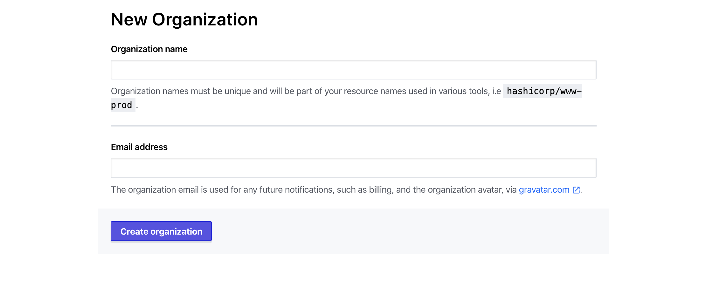
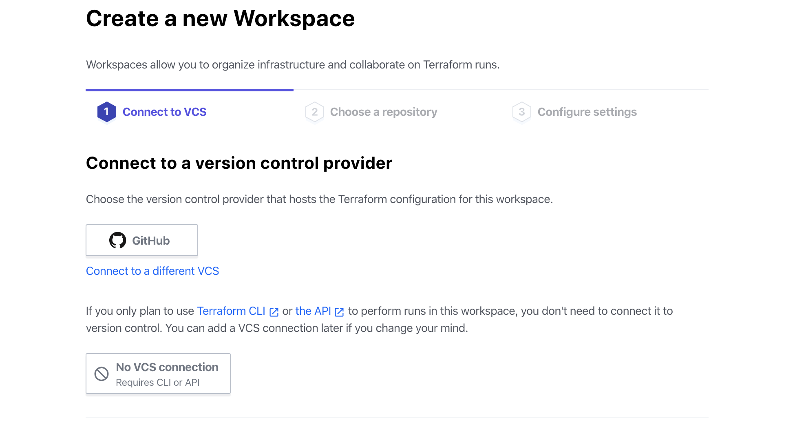
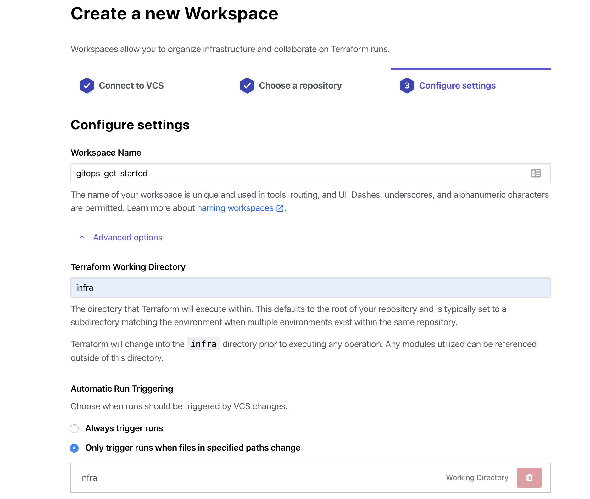
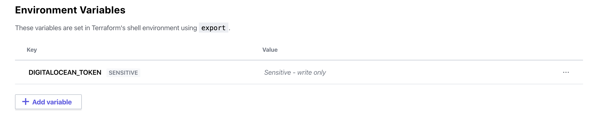

# Setup Terraform Cloud

The Terraform Cloud platform uses Infrastructure as a Code to manage and provide any cloud environment, infrastructure or service.

## Create a new user on Terraform Cloud

If you do not have a user on this platform, use [this following link to create a new one](https://app.terraform.io/signup/account?utm_source=docs_banner) in the free plan.

## Create a new organization

Set up a new organization to manage the project. You can use [this link](https://app.terraform.io/app/organizations/new) to access to your organizations in Terraform.

Then, link your workspace in Terraform Cloud with your repository in GitHub.

List the advanced options to specify the `infra` folder as the source of terraform files within the entire directory.

## Create environment value

Configure the environment variables in Terraform Cloud to connect this platform with Digital Ocean.

Add the environment variable `DIGITALOCEAN_TOKEN` together with the Digital Ocean token obtained in the previous section.

> Don't forget to check the `Sensitive` box to hide the value of the token.

Next: [Create Kubernetes cluster](05-create-cluster.md)
