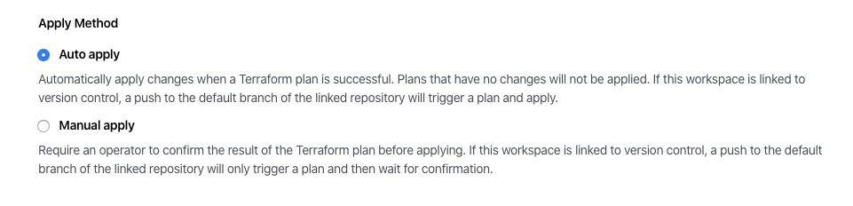
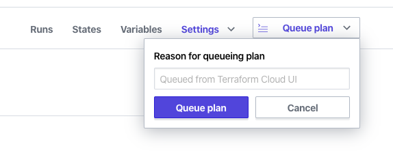
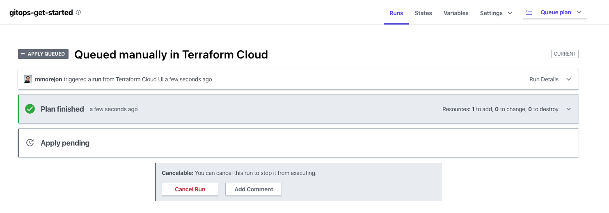
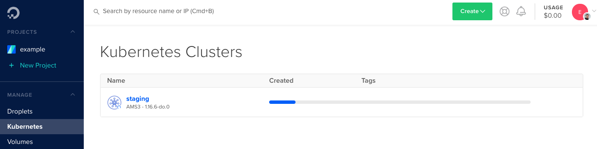

# Crear cluster de Kubernetes

La creación del cluster de Kubernetes se realizará desde Terraform Cloud. El área de trabajo configurada en la sección anterior va a crear la infraestructura a partir del código existente en el repositorio GitHub.

## Cambios automáticos en Terraform Cloud

Terraform Cloud tiene dos formas de establecer los cambios: Manual y Automático.

Para entornos de producción es recomendable utilizar el modo Manual, de esta forma los demás integrantes del equipo podrán analizar los cambios y dar su criterio.

Sin embargo, el ejercicio a realizar en este momento no incluye este escenario, por lo tanto, se van a configurar los cambios de forma Automática.

Acceda a las configuraciones de su área de trabajo y seleccione la opción `Auto apply`.



## Crear el cluster en Digital Ocean

La descripción del cluster de Kubernetes se encuentra en el fichero `infra/cluster.tf`.

```bash
cat infra/cluster.tf

# kubernetes cluster
resource "digitalocean_kubernetes_cluster" "staging" {
  name    = "staging"
  region  = "ams3"
  version = "1.16.6-do.2"
  tags    = ["staging"]

  node_pool {
    name       = "worker-pool"
    size       = "s-1vcpu-2gb"
    auto_scale = true
    min_nodes  = 2
    max_nodes  = 5
  }
}
```

Para crear el cluster utilice el botón `Queue plan` ubicado arriba y a la derecha de la plataforma Terraform.



Una vez iniciado el plan podrá ver en su pantalla cómo se aplican los cambios de Terraform. Esta acción puede demorar unos 7 minutos.



Acceda a la sección de Kubernetes en Digital Ocean y observe que se ha iniciado un cluster de Kubernetes con el nombre `staging`.



Espere a que termine de crearse el cluster para realizar el próximo paso.

## Acceder al cluster desde Kubectl

Una vez creado el cluster será necesario acceder el desde la herramienta `kubectl`. Para lograrlo necesitará obtener las credenciales del nuevo cluster, así como la URL de acceso al API de Kubernetes.

Utilice el siguiente comando para configurar el fichero `~/.kube/config` con las credenciales del cluster de Digital Ocean:

```bash
doctl kubernetes cluster kubeconfig save staging

Notice: adding cluster credentials to kubeconfig file found in "/Users/......./.kube/config"
Notice: setting current-context to do-ams3-staging
```

Compruebe que la configuración se ha realizado correctamente. Liste los nodos del cluster:

```bash
kubectl get nodes

NAME               STATUS   ROLES    AGE     VERSION
worker-pool-0uc4   Ready    <none>   4m43s   v1.16.6
worker-pool-0uch   Ready    <none>   5m38s   v1.16.6
```

Siguiente: [Instalar Flux CD](06-install-fluxcd.md)
