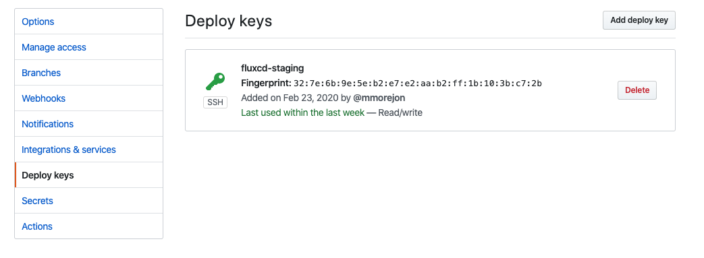

# Sincronizar GitHub <-> Flux CD

Para que Flux pueda obtener la información almacenada en el repositorio de GitHub es necesario habilitar los permisos de lectura.

## Obtener llave ssh

Flux genera una llave ssh al iniciar el sistema. Para obtener esta llave utilice el siguiente comando:

```bash
fluxctl identity --k8s-fwd-ns flux-system

ssh-rsa AAAAB.......
```

## Registrar llave en GitHub

Acceda a la sección *Deploy keys* dentro del repositorio creado en GitHub. Puede utilizar el siguiente enlace para lograrlo:

> Cambie `YOUR-GITHUB-USER` por su usuario en GitHub.

<https://github.com/YOUR-GITHUB-USER/gitops-get-started/settings/keys/new>

Adicione la llave pública ssh generada en el paso anterior.

> Habilite también los permisos de escritura si desea que Flux pueda realizar cambios en el repositorio.



## Sincronizar Flux con el repositorio

Flux sincroniza los cambios existentes en el repositorio de forma automática basándose en el tiempo establecido en el parámetro `git.pollInterval`. Por defecto el valor es `5m`, pero si no desea esperar este tiempo puede utilizar el siguiente comando:

```bash
fluxctl sync --k8s-fwd-ns flux-system
```

Esta línea de comando le indica al sistema flux que sincronice el estado de los objetos del cluster con los elementos existentes en el repositorio git.

### Registros en Flux

Acceda a los registros del sistema flux y compruebe que ha podido acceder correctamente a GitHub.

```bash
kubectl -n flux-system logs -l app=flux
```

### Carpetas sincronizadas

Una vez lograda la sincronización entre Flux CD y GitHub podrá observar que todos los elementos existentes en la carpeta `namespaces` han sido creados en el cluster.

```bash
kubectl get namespaces

NAME              STATUS   AGE
admin             Active   17m
client-abc        Active   17m
client-def        Active   17m
default           Active   107m
flux-system       Active   60m
kube-node-lease   Active   107m
kube-public       Active   107m
kube-system       Active   107m
```

Liste los Pods existentes en estos namespaces y notará la correspondencia con los servicios descritos en el repositorio de GitHub.

```bash
kubectl get pods -n client-abc && kubectl get pods -n client-def

NAME                       READY   STATUS    RESTARTS   AGE
app-abc-6b6c9d5599-kbddb   1/1     Running   0          24m
app-abc-6b6c9d5599-ltql7   1/1     Running   0          24m
NAME                       READY   STATUS    RESTARTS   AGE
app-def-5bd5d956c5-d64r7   1/1     Running   0          24m
app-def-5bd5d956c5-md5vz   1/1     Running   0          24m
app-def-5bd5d956c5-vdjx2   1/1     Running   0          24m
```

## Flujo de trabajo utilizando GitOps

En este momento usted podrá gestionar su cluster a través de la filosofía de trabajo GitOps.

Los cambios establecidos en el cluster deberán estar en el repositorio Git y será Flux CD quién se encargue de mantener sincronizado el estado de los objetos en Kubernetes.


Le sugiero que a partir de este momento modifique los componentes existentes y evalúe cómo reaccionan. Es importante que entienda que la estructura existente en este repositorio corresponde con un caso de ejemplo, usted deberá identificar cuál es la estructura de repositorio que mejor corresponde con su negocio.

Siguiente: [Gestionar Secrets utilizando Sealed Secrets](08-sealed-secrests.md)
