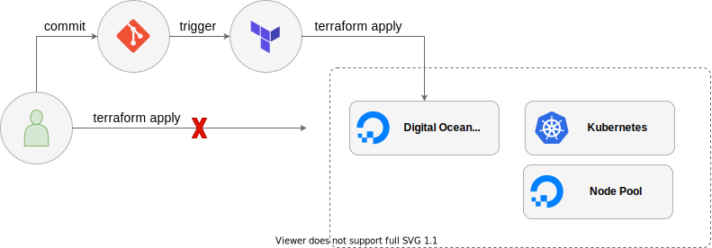
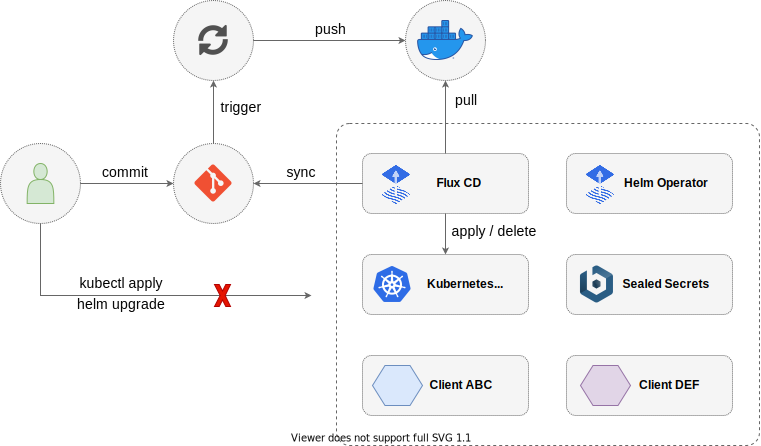

# gitops-get-started

Proyecto para dar los primeros pasos en la filosofía de trabajo GitOps utilizando Flux CD.

El proyecto muestra cómo configurar un cluster de Kubernetes basándose en GitOps. La organización de carpetas y servicios desplegados corresponden con un hipotético cluster utilizado para entornos de desarrollo o pruebas. Esta configuración del cluster no está lista para ser utilizada en producción.

Para sacar mayor provecho del repositorio se recomienda tener conocimientos básicos sobre la filosofía de trabajo GitOps. Puede ampliar sus conocimientos sobre este tema a través de [este enlace del sitio Weaveworks](https://www.weave.works/technologies/gitops/).

Los sistemas utilizados durante el ejercicio fueron: [Git](https://git-scm.com/), [Terraform](https://www.terraform.io/), [Flux CD](https://fluxcd.io/) y [Kubernetes](https://kubernetes.io/). La plataforma utilizada para crear el cluster de Kubernetes es [Digital Ocean](https://www.digitalocean.com/), pero también puede utilizarse [Minikube](https://minikube.sigs.k8s.io/).

Flujo para gestionar la infraestructura



----

Flujo para gestionar Kubernetes



## Estructura de carpetas

```bash
├── infra
│   └── cluster.tf
├── namespaces
│   ├── admin
│   │   ├── namespace.yaml
│   │   └── sealed-secrets
│   │       └── sealed-secrets.yaml
│   ├── client-abc
│   │   ├── deployment.yaml
│   │   └── namespace.yaml
│   ├── client-def
│   │   ├── deployment.yaml
│   │   └── namespace.yaml
│   ├── flux-system
│   │   └── namespace.yaml
│   └── kube-system
│       ├── kube-state-metrics
│       │   └── kube-state-metrics.yaml
│       └── metrics-server
│           └── metrics-server.yaml
└── scripts
    └── install.sh
```

| Carpeta    | Descripción |
| ---------- | ----------- |
| infra      | Ficheros terraforms para crear la infraestructura en Digital Ocean. (Opcional) |
| namespaces | Estructura de namespaces utilizados en el cluster. Dentro de cada namespace se encuentran las aplicaciones que serán desplegadas. |
| scripts    | Carpeta de utilidades generales.|

## Secciones del caso práctico

Los siguientes enlaces le van a guiar en la creación de un cluster de Kubernetes utilizando la filosofía de trabajo GitOps.

* [Herramientas necesarias](01-client-tools.md)
* [Configurar el repositorio](02-clone-repository.md)
* [Configurar Digital Ocean](03-setup-digital-ocean.md)
* [Configurar Terraform](04-setup-terraform-cloud.md)
* [Crear cluster de Kubernetes](05-create-cluster.md)
* [Instalar Flux CD](06-install-fluxcd.md)
* [Sincronizar GitHub <-> Flux CD](07-syncronice-github-fluxcd.md)
* [Gestionar Secrets utilizando Sealed Secrets](08-sealed-secrests.md)
* [Limpiar](09-cleaning-up.md)
